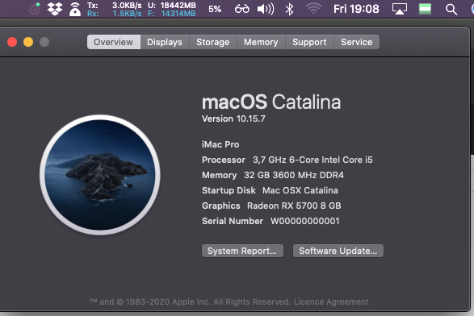

# OpenCore 0.6.4 EFI for ROG STRIX B550-I GAMING

# Specification

| **Component** | **Model** |
| ------------- | --------- |
| CPU | AMD Ryzen 5 5600X (19h) |
| Motherboard | ASUS Rog Strix B550i |
| RAM | LPX VENGEANX 3600Mhz |
| Audio Chipset | ALC-S1220A |
| GPU | RX5700XT |
| WiFi & Bluetooth | Intel® Wi-Fi 6 AX200 |
| Lan |  Intel® I225-V 2.5Gb Ethernet |
| OS Disk | Samsung 960 Evo 1To |
| macOS | Catalina 10.15.7/ OpenCore 0.6.4 (PRE-RELEASE)

## What works
- Audio (`alcid=3`)
- Ethernet
- USB
- Wi-Fi
- Bluetooth
- iMessage, FaceTime (Need to follow https://dortania.github.io/OpenCore-Post-Install/universal/iservices.html)
- AMD Power management
- Docker (with docker-machine through VirtualBox)
- Includes latest patches form Ryzen 5000 series (see topic https://forum.amd-osx.com/index.php?threads/ryzen-5000-series-opencore-update.1164/)

## Known issues
- Sleep doesn't work
- Sometimes bluetooth stops working, you will have to reset nvram boot into windows/linux check if it works and then reboot in mac osx

## Credits
- everyone developing for the hackintosh community
- the [dortania team](https://github.com/orgs/dortania/people)
- base efi [huukhai/hackintosh-rog-b550i](https://github.com/huukhai/hackintosh-rog-b550i)
